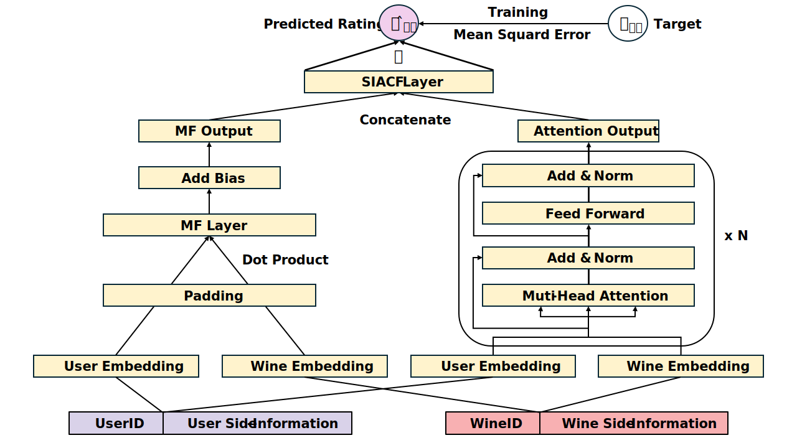

## 🍷 Side-Informed Attention Collaborative Filtering (SIACF)

Welcome! This repository introduces our paper:

- **Byungmin Kim**, Minsu Chu, and Hyunjoo Song, ["Side-Informed Attention Collaborative Filtering for Enhanced Wine Rating Predictions"](doi), *Human-centric Computing and Information Science (HCIS)*, 2025. [Accepted Manuscript]

## 📌 Overview
This research addresses the task of rating prediction in recommendation systems, focusing on the unique domain of wine, which presents richer and more complex side information compared to typical items like movies or books.

Key characteristics of wine considered in our work:

- **Rich Attributes** — Compared to other items in recommendation systems (e.g., MovieLens), wine has more characteristics contributing to its complexity. Prior research examined 17 attributes (e.g., grape variety, alcohol content, and production region), but this does not represent an exhaustive list of characteristics.
- **Vintage Distinction** — Even wines from the same producers, brands, and grape varieties are considered distinct if they come from different vintages, which refers to the year the grapes were harvested. This differs from books or movies, where such distinctions from publication or production years do not exist.
- **Aging Effects** — Even for the same vintage, the age of the wine—referring to the number of years since the vintage at the time of consumption—can influence user ratings as its taste changes over time. Unlike other items, such as books or movies, which may age but retain the same content, the wine matures and evolves over decades as it follows a unique lifecycle known as the "drinking window".
- **Rarity and Accessibility** — Accessing high-priced wines produced in small quantities or aged for a long time can be challenging. This introduces a unique accessibility challenge not typically seen with books or movies, which are generally more readily available.

However, most existing models are primarily designed around user-item interactions, which limits their ability to effectively utilize the complex characteristics of wine. 

## 🛠️ Architecture

To address these challenges, this study draws inspiration from the common practice in wine tasting, where different characteristics are assessed separately. We therefore propose a Side-Informed Attention Collaborative Filtering (SIACF) architecture that integrates matrix factorization and attention mechanisms:  
- **Matrix Factorization** for capturing linear user-item interactions.
- **Multi-Head Attention** for modeling non-linear and complex relationships.
- **Model-Level Attention** to dynamically balance contributions from both components.
<br>


<div align="center">
  <b>Fig. 1. Side-Informed Attention Collaborative Filtering Architecture</b>
</div>
<br>

Our work focuses on the **unique characteristics of wine**, such as vintage, aging effects, and rich side information, and demonstrates improvements in rating prediction accuracy.

## 📝 Contributions
- **First domain-specific model for wine rating prediction** — SIACF is the first model to explicitly integrate user-item interactions with detailed side information tailored to the wine domain.
- **Hybrid architecture capturing both linear and non-linear patterns** — Our model combines matrix factorization and attention mechanisms for more expressive predictions.
- **Performance improvements on domain-specific data** — SIACF demonstrated superior accuracy (MAE, RMSE) over existing baselines on the X-Wines dataset.
- **Cross-domain validation** — Our model generalizes beyond wine, showing competitive results on the MovieLens dataset.


## 📊 Dataset
The dataset used in this study is [X-Wines](https://github.com/rogerioxavier/X-Wines), a real-world wine dataset with 5-star user ratings for recommendation systems. The dataset was filtered to include only wines rated at least five times, and it contains data only from users who have rated these selected wines at least five times. We primarily used the *Slim set* version of the dataset for our experiments.  

The dataset statistics:
- 10,561 Users  
- 995 Wines  
- 140,357 Ratings  (**Sparsity: 98.66%**)

It also provides rich side information for each wine, including vintage, grape variety, body, acidity, alcohol content, region, and more. To focus on vintage characteristics, we excluded non-vintage (N.V.) wines from our study.

## 📖 Citation
If you use or refer to our work, please cite:  
✅ Note: Accepted Manuscript (not yet formally published)  

```
@article{placeholder,  
title={Side-Informed Attention Collaborative Filtering for Enhanced Wine Rating Predictions},  
author={Kim, Byungmin and Chu, Minsu and Song, Hyunjoo},  
journal={HCIS},  
year={2025}  
}  
```
